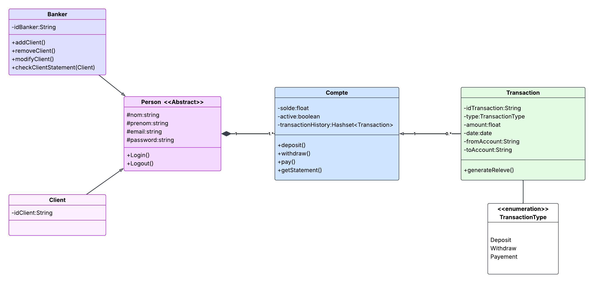
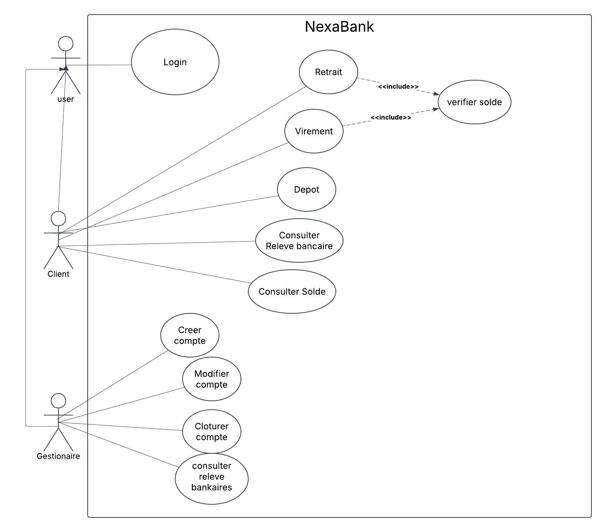

# NexaBank

Application bancaire en ligne de commande, écrite en Java, permettant la gestion de clients, de comptes bancaires et de transactions.

## Description

NexaBank est une application console qui simule une banque. Elle repose sur une **architecture en couches** :

- **Modèles** : représentent les entités du domaine (Client, Banker, Compte, Transaction, Person).
- **Services** : contiennent la logique métier (authentification, opérations sur les comptes, transactions, écriture des fichiers).
- **Utilitaires** : helpers réutilisables pour l'affichage et la saisie.

Cette séparation facilite la **testabilité** : la logique métier est indépendante du terminal et peut être testée sans interaction utilisateur.

## Fonctionnalités

- Authentification d'un client ou d'un banquier (email / mot de passe)
- Le banquier peut :
  - Créer un compte pour un client
  - Bloquer / débloquer un compte
  - Consulter les comptes et les clients
- Le client peut :
  - Effectuer un dépôt
  - Effectuer un retrait
  - Effectuer un virement entre comptes
- Enregistrement de l'historique des transactions
- Écriture de chaque transaction dans un fichier texte 

## Compilation et exécution

```bash
javac -d out *.java && java -cp out Main.java
```

## Diagrammes UML

### Diagramme de classes



### Diagramme de séquence


### Diagramme de cas d'utilisation


